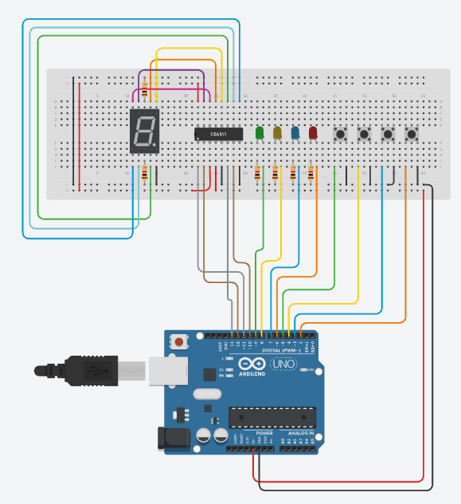

# Design Final Project

This project recreates the Simon memory game using an Arduino, push buttons, and LEDs. At the start of each round, the LEDs display a color sequence. The length of the color sequence starts at one, and it increases by one each round. After the sequence is displayed, the user then must push the buttons in the same order that the lights flashed. If the player succeeds, they move on to the next round. If they fail, the game will end and their score will scroll on the seven segment display. You can see a full demo [here](https://www.youtube.com/watch?v=--_8O7VfdAY).

